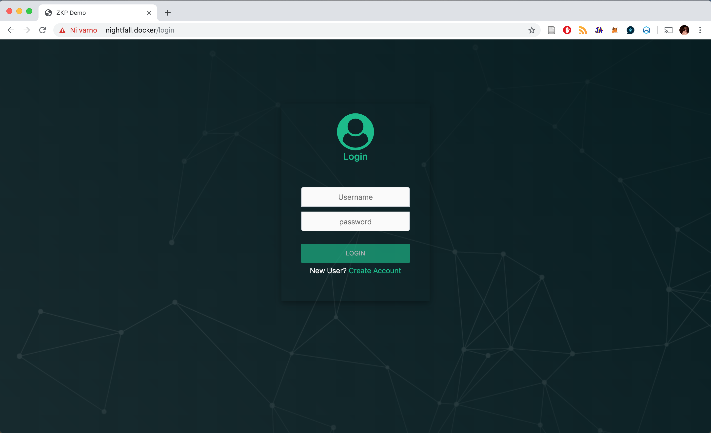
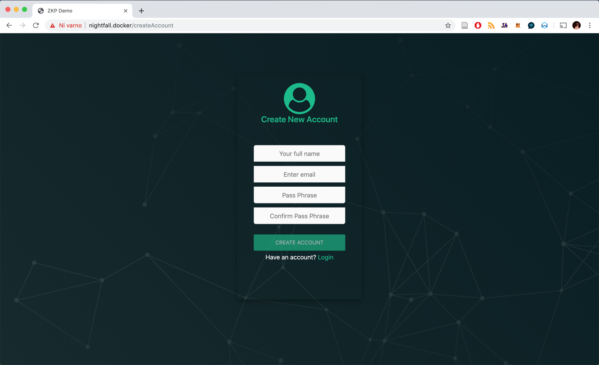
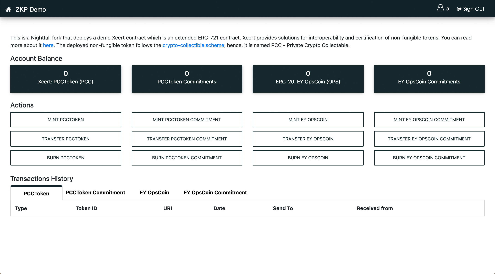
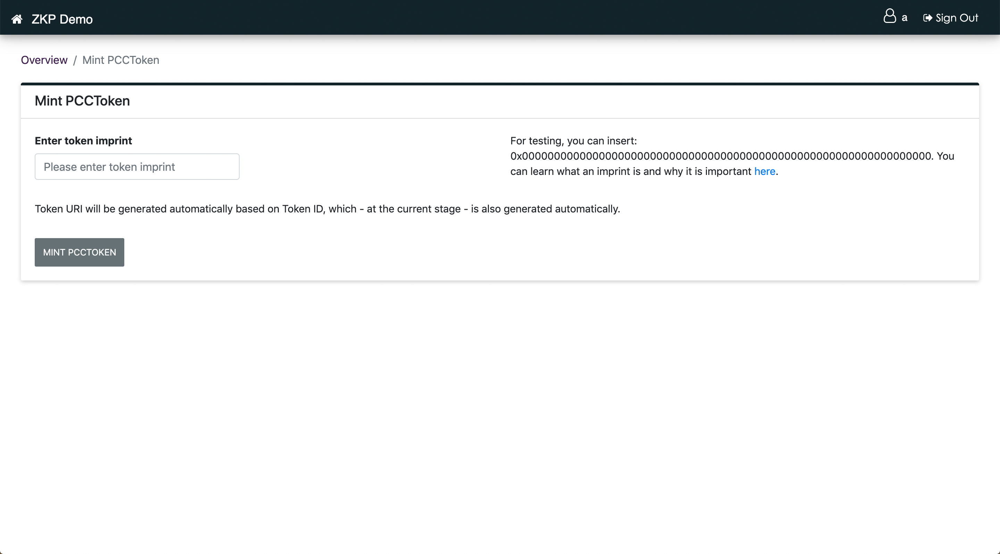
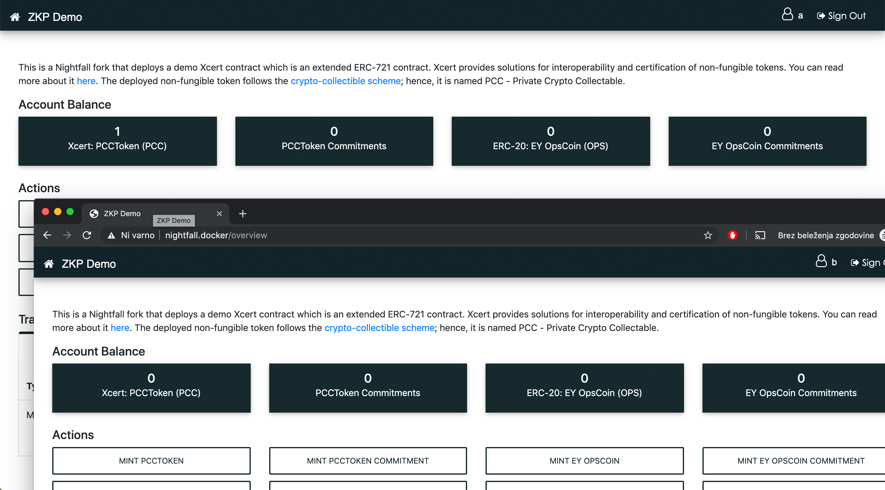
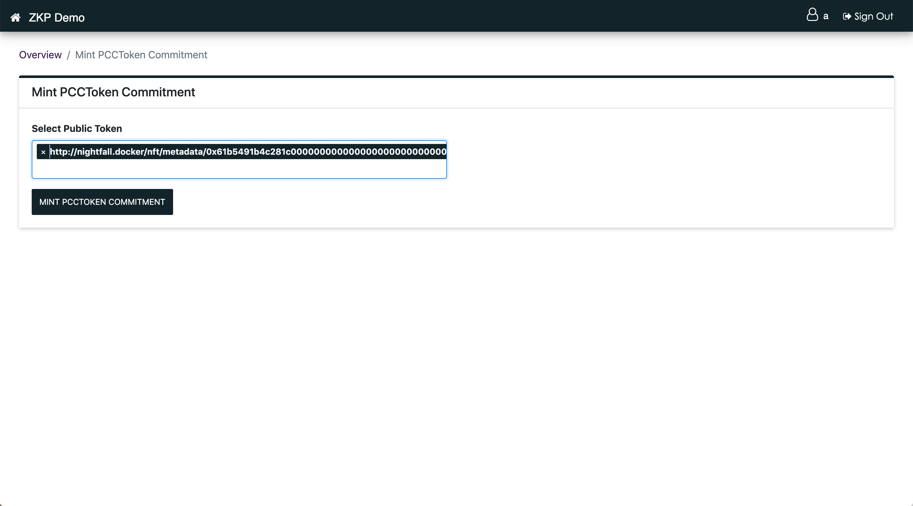
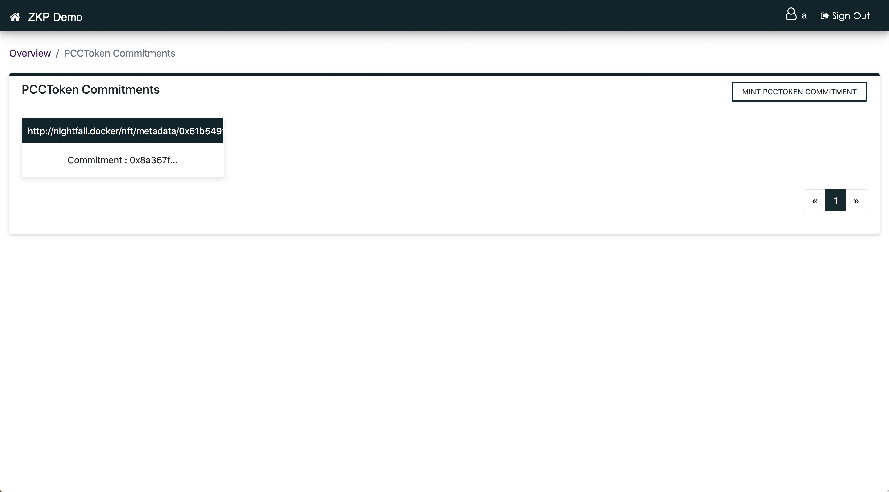
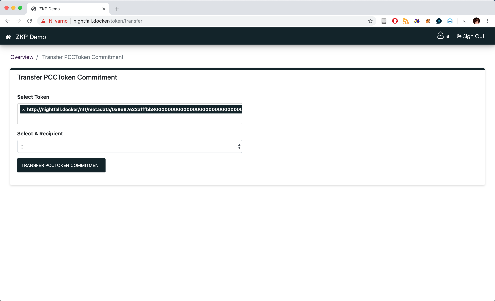
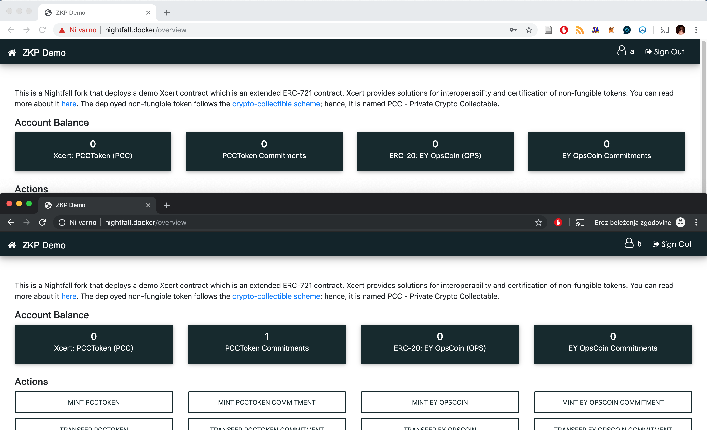

# Using the demonstration user interface

If you have followed the [README.md](./README.md) successfully, you will have the UI ready in your browser window. The first screen you will see will be the login screen.

## Account creation and login

We have no user accounts on the system to start with (the startup script clears down the database). To create one, click on the `Create Account` hypertext. This will open a new window where you can
add account details. We tend to type "a" or "b" in all fields to create Alice or Bob accounts:

Hit the `CREATE ACCOUNT` button when you are ready, and you will be taken back to the login screen from where you can use the newly created account to log in. This will take you to the UI's home
screen:

This screen has four columns. Reading from left to right, they deal with: conventional Xcert transactions; hidden Xcert transactions; conventional ERC-20 transactions and hidden ERC-20 transactions.

If you used the `./zkp-demo` startup script, ERC-20 and Xcert token contracts will be deployed for you. The name of the Xcert token (PCC in this case) has been read from the Xcert contract. These will allow you to freely create (mint), transfer, and burn (destroy) conventional tokens for demonstration purposes.

You cannot use hidden (ZKP) transactions without firstly creating conventional tokens. Note that the terms 'mint' and 'burn' when applied to hidden transactions have a slightly different meaning: minting a hidden token actually creates hiding for an existing conventional token and burning it recovers the original token from the hiding.

Let's mint an Xcert. Click the `MINT PCCTOKEN` button on the right. This will open a dialogue box where you specify the token imprint. For the demo, lets just insert `0x0000000000000000000000000000000000000000000000000000000000000000`; for real usage, you would calculate the actual imprint. More about this can be read [here](https://docs.0xcert.org/guide/certification.html.

By clicking the button, you will return to the home screen, and your Xcert balance will be updated. The tabs in the lower half of the screen will show the history of each type of the token. You should see your mint transaction in the `PCCToken` tab.

At this point in the demonstration, we can only transfer tokens to user "a" because we have no other users. Even though this works, it's a little pointless.

Let's set up another user. We want this second user to be logged in at the same time as the user "a" and be completely independent. To do that on the same computer, we need to open another web browser (a separate tab won't do). There are two ways to do that. Either use a different browser (e.g., Firefox and Chrome) or open an incognito/private-browsing window (or whatever your browser calls it). To the system, this looks like a completely separate browser application. In the screenshot below, we've used Chrome's incognito window, created the user "b" and logged them in:

At this point, we could simply transfer the Xcert to user "b" but that would be visible to the entire blockchain. Instead, let's make a hidden transaction using zero-knowledge proofs.

First, we have to create a token commitment via the PCCToken Commitment mint button. Since we have only one token, we pick that one.

The next screen shows our freshly minted token commitments. You can access this screen at any time by clicking the black column-header in the Private PCCToken screen:

These mints take a minute or so to complete. This is due to the time it takes to compute the minting proof. We know it's possible to improve the constraint system and do it faster, but we're mainly focused on the on-chain verification costs at present. The terminal screen from which you launched `./zkp-demo` will show you what is happening.

Once we have the coins minted, we can transfer them using the transfer button `TRANSFER PCCTOKEN COMMITMENT`. This will open up a page where we select the token and specify the recipient.

Clicking on Transfer will begin generation of the transfer proof and finally transfer the commitment to the user b. The proof calculations will take about 10 minutes because they need to calculate a proof that knows a path through the Merkle tree of commitments. In this demonstration UI, we make the transfer modal so that the user can track what is going on, but actually, a promise is returned, so there's no fundamental need to wait around.

In the picture below, you can see that the user b (Bob) has received the Xcert commitment.

User b can change these commitments back into Xcert tokens if they wish to do so, by conducting a burn transaction.